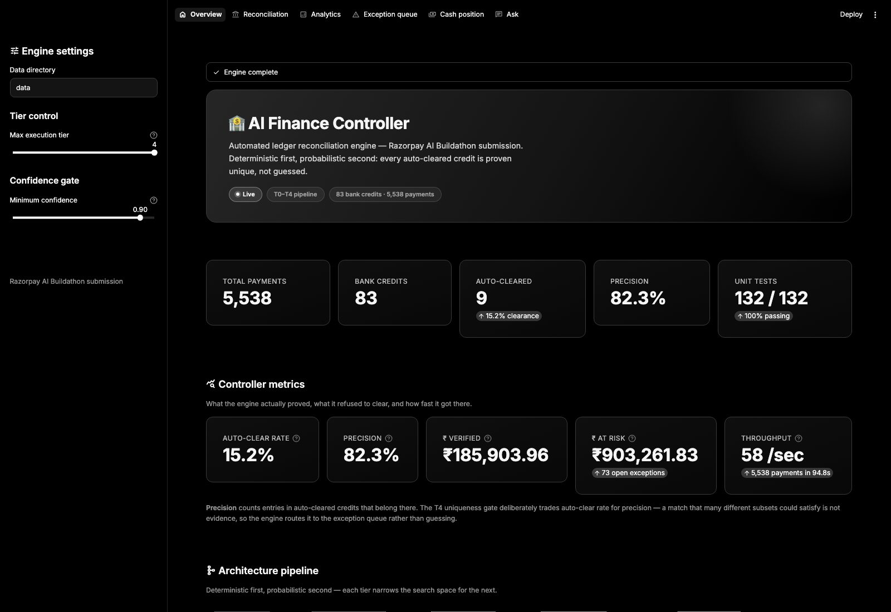
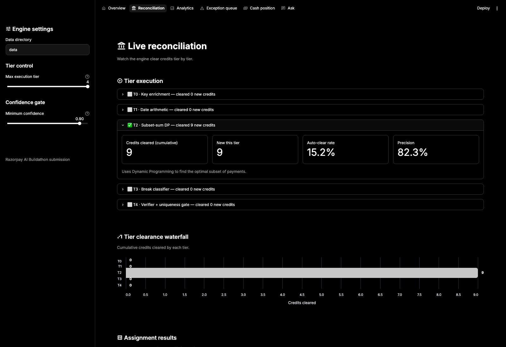
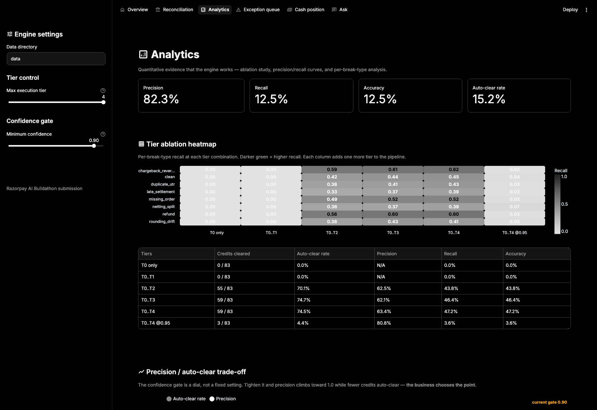
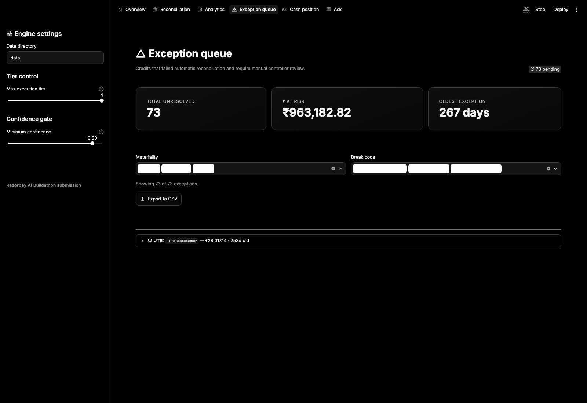
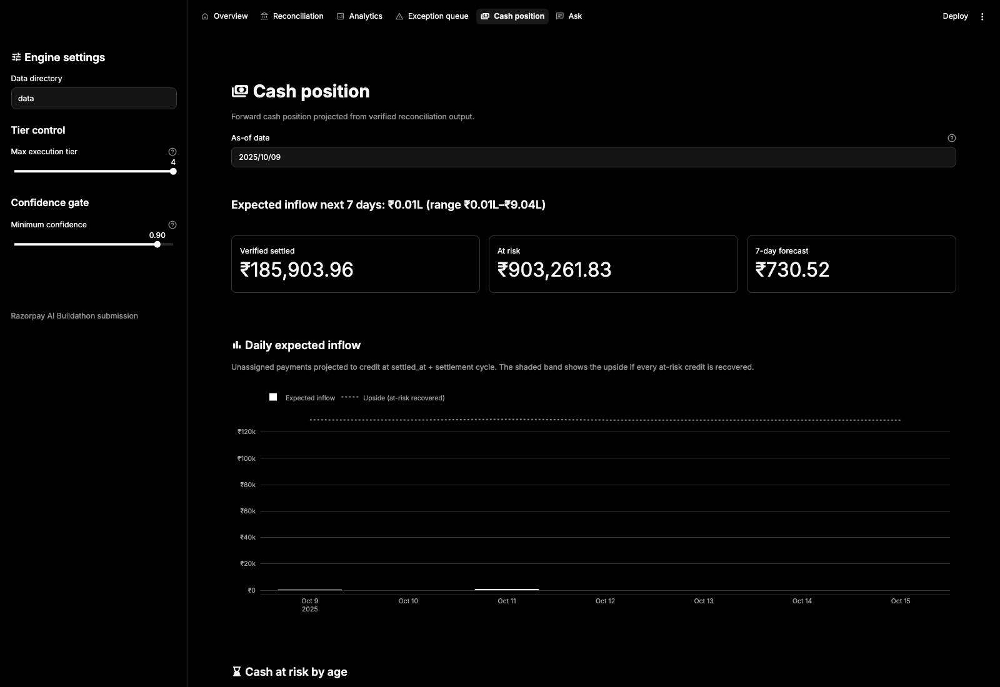
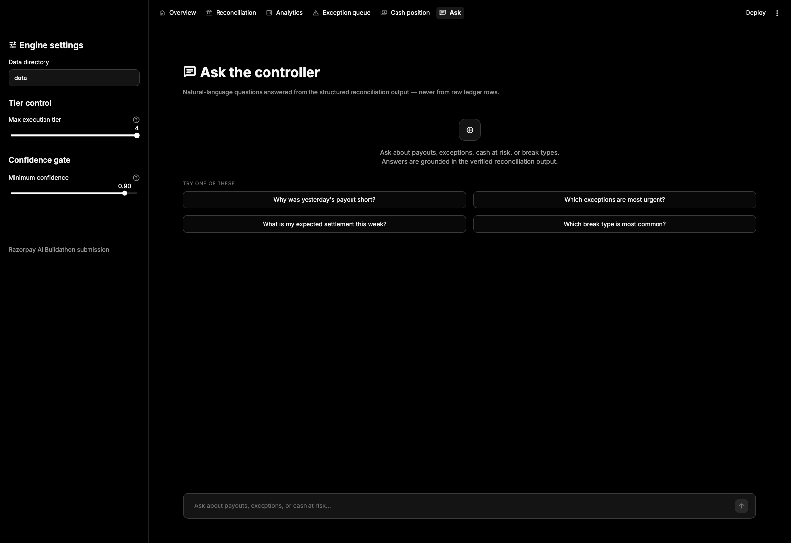

# AI Finance Controller — Ledger Reconciliation Engine

*A Razorpay AI Buildathon Submission*

This repository contains the **Ledger: Settlement Reconciliation Engine**, a tiered hybrid system designed to reconcile netted bank credits against individual payment ledger entries without shared keys.

## The Problem

A merchant receives netted bank credits from a payment gateway. One credit covers 80–140 individual payments, minus a per-payment fee and 18% GST on that fee, landing at T+2. Refunds and chargebacks appear as negative adjustments inside later credits.

Reconciliation means proving mathematically that each bank credit equals a specific set of payments minus fees, and flagging what doesn't reconcile.

## Design Principles

1. **Never fabricate a match.** High precision is prioritised over high recall — an unevidenced auto-clear is worse than an honest exception.
2. **Deterministic first, probabilistic second.** Traditional algorithms where they work; an LLM only where *structural* reasoning is needed; and the LLM's arithmetic is never trusted — every figure the engine reports is produced deterministically.

## Quickstart (For Judges)

1. **Setup Environment**
   ```bash
   pip install -r requirements.txt
   export GROQ_API_KEY="your_api_key_here"   # Optional — see below
   ```

   `GROQ_API_KEY` is **optional**. With it, T3 uses an LLM (default
   `qwen/qwen3.8-27b`, override with `LLM_MODEL`) to classify break shapes.
   Without it:
   * **T3 break classification** falls back to a deterministic refund-aware
     heuristic, so the full reconciliation pipeline still runs end to end.
   * If the key is present but the per-minute token quota is hit mid-run, T3
     backs off for the API-suggested delay (a bounded per-run budget,
     `T3_BACKOFF_BUDGET_S`); once that budget is spent it trips a circuit
     breaker and the remaining credits fall back to the heuristic solver
     rather than each burning another doomed request. On a shared free-tier
     quota T3 runs **serially** by default (`T3_LLM_MAX_WORKERS=1`) — raise
     it when the account has real throughput headroom.
   * **The Settlement Q&A agent** is the one feature that genuinely requires
     the key; the page degrades to a "Set GROQ_API_KEY to enable natural
     language queries" message instead of erroring.

   Every number the engine reports is produced deterministically either way —
   the LLM only ever proposes a *hypothesis* (a break class + a structured
   action), never a figure. `resolve_hypothesis()` then re-runs real
   arithmetic and T4 re-verifies.

2. **Run the Interactive Demo**
   ```bash
   make demo
   ```
   Opens the **Streamlit dashboard** on `http://localhost:8501`.

3. **Run the Quantitative Evaluation (Ablation Study)**
   ```bash
   make eval
   ```
   Generates synthetic ledger data with injected edge cases (late settlements, refunds, chargebacks, missing orders) and runs the multi-tier engine against it, outputting a tiered ablation table showing what each tier contributes to auto-clear rate, precision, recall and accuracy.

4. **Run the Precision / Auto-Clear Confidence Curve**
   ```bash
   make curve
   ```
   Shows how adjusting the LLM confidence gate lets a business trade off between auto-clear rate and absolute precision.

## Dashboard pages

| Page | What it shows |
|------|---------------|
| **Overview** | Headline metrics — auto-clear rate, precision, ₹ verified, ₹ at risk, throughput, unit-test count |
| **Reconciliation** | Tier-by-tier execution, assignment table, **Export audit trail** (CSV) |
| **Analytics** | Ablation heatmap, precision / auto-clear curve, per-break recall, summary tiles (precision · recall · **accuracy** · auto-clear rate) |
| **Exception queue** | Structured break codes, materiality / aging filters, evidence, CSV export |
| **Cash position** | 7-day forward inflow forecast with confidence band and cash-at-risk aging |
| **Ask** | Natural-language Q&A over the reconciliation output (requires `GROQ_API_KEY`) |

## Screenshots

**Overview** — headline metrics, controller metrics with the precision/auto-clear-rate trade-off explained, and the T0–T4 architecture pipeline.



**Reconciliation** — tier-by-tier execution log, cumulative clearance waterfall, and the full assignment table with per-payment confidence.



**Analytics** — the tier ablation heatmap (per-break recall at every tier combination) and the precision / auto-clear trade-off curve.



**Exception queue** — every unresolved credit with materiality, age, evidence, and the **"Why did this break?"** LLM explanation button.



**Cash position** — verified-settled vs at-risk, a 7-day forward inflow forecast, and cash-at-risk aging buckets.



**Ask** — the chat interface over the reconciliation output, grounded in structured evidence rather than raw ledger rows.



## Architecture

The engine uses a tiered "deterministic first, probabilistic second" control loop:

| Tier | Name | Kind | Job |
|---|---|---|---|
| **T0** | Key enrichment | Deterministic | Join `orders.csv` + `settlements.csv` on `payment_id` (`validate="m:1"` — a fan-out here would silently corrupt every downstream metric). Missing orders are retained: the bank still credited us for them. |
| **T1** | Date-window arithmetic | Deterministic | Clear perfect date-boundary batches where the unassigned payments on one date sum exactly to a credit. Usually clears little, but narrows the search space for T2. All arithmetic in **integer paise** (`int(round(v*100))`) to kill floating-point drift. |
| **T2** | Constrained subset-sum | Deterministic | Bitmask exclusion-DP: find the few entries to *exclude* to hit the excess (Σcandidates − target), not the many to include. Progressive window expansion (strict → +3d → +6d). |
| **T3** | Break classification agent | Probabilistic | Send **diagnostics, not rows** to the LLM (compact ~300-token prompt, JSON mode); get back a `break_classification` and a *structured hypothesis*. `resolve_hypothesis()` then tests that hypothesis with real arithmetic. Deterministic heuristic fallback when no LLM is available or the per-run token budget is spent. Serial by default on a shared quota (`T3_LLM_MAX_WORKERS`); deterministic resolution stays strictly sequential against the live ledger. |
| **T4** | Arithmetic verifier + uniqueness gate | Deterministic gate | Re-check every claim's sum (±₹0.50) and index availability, then count *how many distinct subsets* hit the target. Uniqueness — not sum-equality — is the evidence. |

See [ARCHITECTURE.md](./ARCHITECTURE.md) for the full design rationale, including the exclusion-DP, the integer-paise standard, the T4 uniqueness gate, and the bitset subset-sum optimisation.

### The T4 uniqueness gate

Sum-equality is tautological — any subset the solver returns sums to the target. The real question is *"is this the **only** subset that does?"* T4 re-derives the candidate pool for a credit and counts distinct solutions:

| Solution count | Verdict | Reason code | Confidence |
|---|---|---|---|
| `1` | Accept — match is *proven* | `UNIQUE_MATCH` | `1.0` |
| `2 – 10`, enumeration exhaustive | Accept the **intersection** of all valid subsets | `AMBIGUOUS_PARTIAL` | `0.75` |
| `2 – 10`, enumeration **not** exhaustive | Accept the proposed subset (it passed the ±₹0.50 sum check) at reduced confidence | `AMBIGUOUS_PARTIAL` | `0.65` |
| `> 10` | **Reject** — do not auto-clear | `NON_UNIQUE` | — |

The candidate-pool window is **±7 days** around the credit's `value_date` (a first-pass narrow window), which keeps the enumeration exhaustive far more often, so the `AMBIGUOUS_PARTIAL` path fires naturally instead of collapsing to a blanket `NON_UNIQUE` rejection.

## Evaluation Harness

Because the engine is stochastic at T3, it ships a formal evaluation harness (`eval/harness.py`). It generates synthetic ledgers with injected breaks and evaluates the engine at every tier.

**Metrics reported** (`eval/metrics.py`):

| Metric | Definition |
|---|---|
| `auto_clear_rate` | payments assigned / total payments — *coverage*, not correctness |
| `precision` | payments assigned **to the right credit** / payments assigned |
| `recall` | correct assignments / total payments |
| `accuracy` | correct assignments / total payments (same as recall on this task — the fraction of the ledger placed correctly). Replaces an earlier "F1" that mixed a precision numerator over *assigned* with a recall denominator over *all payments* and was not a well-defined F1. |
| per-break `recall` | the same, sliced by injected break type |

Ground truth is aligned to the engine output **by `payment_id`** (`set_index(...).reindex(...)`) before any comparison — positional row alignment is never assumed.

### Measured results — 5,538 payments / 83 credits, seed 42, medium difficulty

**LLM classifier active** (`GROQ_API_KEY` set, `qwen/qwen3.8-27b`):

| metric | T0 | T0..T1 | T0..T2 | T0..T3 | T0..T4 | T0..T4 @0.95 |
|---|---|---|---|---|---|---|
| auto_clear_rate | 0.000 | 0.000 | 0.701 | 0.722 | **0.717** | 0.044 |
| precision | – | – | 0.625 | 0.630 | **0.635** | **0.808** |
| recall / accuracy | 0.000 | 0.000 | 0.438 | 0.455 | **0.455** | 0.036 |
| credits_cleared | 0/83 | 0/83 | 55/83 | 57/83 | **57/83** | 3/83 |

`Reconciled 5538 payments across 83 credits in ~90s (dominated by LLM round-trips) — the deterministic tiers alone run in ~1.4s.` T3 is stochastic, so these move ±1–2 credits / ±0.01 precision between runs.

**How to read it.** T3's LLM classifier **raises precision** (0.625 → 0.635) *and* recall (0.438 → 0.455) over the deterministic tiers, while clearing fewer credits than the blunt heuristic would (57 vs 64) — the ones it does clear are more likely to be right, which is the correct trade for a financial ledger. Per-break, the LLM wins exactly where structure matters: `netting_split` 0.360 → 0.386, `refund` 0.564 → 0.588, `chargeback_reversal` 0.592 → 0.599. T4's uniqueness gate then nudges precision up another notch (0.630 → 0.635) by rejecting the few unevidenced claims. `@0.95` trades almost all the auto-clear rate for **0.808 precision** — the setting a controller who needs a trustworthy figure would run.

**Deterministic-only** (`GROQ_API_KEY` unset — T3 = refund-aware heuristic), for comparison:

| metric | T0..T2 | T0..T3 | T0..T4 | @0.95 |
|---|---|---|---|---|
| auto_clear_rate | 0.701 | 0.772 | 0.772 | 0.044 |
| precision | 0.625 | 0.578 | 0.578 | 0.808 |
| credits_cleared | 55/83 | 64/83 | 64/83 | 3/83 |

The heuristic clears more (64) at lower precision (0.578); the LLM path is the more *selective* one.

> Earlier, T4's uniqueness gate rejected *every* T3 claim: with 100–140-entry pools the enumeration DP hit its state ceiling before proving anything, so `not exhaustive` fired a blanket `NON_UNIQUE` and the `T0..T4` column fell back to exactly the `T0..T2` numbers. Narrowing the pool window to ±7 days and adding the non-exhaustive `AMBIGUOUS_PARTIAL @ 0.65` branch is what lets T3 reach production through the verifier.

### Performance: the bitset subset-sum

T2's inner loop is the whole engine's cost centre. It carries the reachable-sum set as a **bitmask inside one Python integer** — bit *s* set means "sum *s* is reachable", so a whole relaxation step is `reach |= reach << v`, one C-speed big-integer shift instead of a Python loop. Because the search now *completes* instead of hitting an iteration cap, T2 clears **55/83 credits instead of 30/83**, lifting recall from 0.304 to 0.438:

| | before | after |
|---|---|---|
| full pipeline | 233.7s | **~1.4s** |
| throughput | 24 /sec | **~3,900 /sec** |
| `make eval` (ablation) | ~20 min | **~10s** |
| credits cleared (T2) | 30/83 | **55/83** |

### A scaling note on date windows

T1 and T2 partition candidates by settlement-date window, anchoring each to the **previous distinct `value_date`** — several credits can share a `value_date`, and keying off the immediately preceding row hands every credit after the first an inverted, empty window. That constraint also shapes the generator: `capture_window_days` scales with `num_payments` (270 days at 5,000 payments), otherwise up to 9 credits land on one date, collapsing every window into one multi-batch pool and inflating the exclusion-DP's excess past its cap — clearing **zero** credits.

## The Exception Queue

Every credit the engine declines to clear becomes a structured row via `build_exception_report()`. Each carries a `break_code` (`WINDOW_DEFICIT`, `NO_CANDIDATES`, `SUM_COLLISION`, `UNRESOLVED`, or T3's classification), `materiality` (HIGH > ₹50k, MEDIUM > ₹5k, LOW), `age_days`, `delta_inr` against the closest subset found, T3's `hypothesis`, a derived `suggested_action`, and JSON `evidence` naming the closest candidate entry_ids.

## Cash Position Module

`recon/cashflow.py` turns the verified output into a forward-looking treasury view. `build_cash_position()` returns `verified_settled`, `at_risk`, a 7-day `expected_inflow` forecast, a `confidence_interval` bracketing "every at-risk credit lost" vs "every one recovered", and `cash_at_risk_by_age` bucketed `<3d / 3-7d / >7d`. Because T4 refuses unevidenced matches, `verified_settled` is a figure a controller can rely on.

## Audit Trail

`export_audit_trail()` emits one row per payment so any assignment can be defended after the fact — `run_id` (uuid4 per `reconcile()` call), `entry_id` / `payment_id`, `assigned_utr`, `assigned_tier` / `tier_name`, `reason_code`, `confidence`, `evidence` JSON, `reconciled_at`. Downloadable as CSV from the Reconciliation page.

## Testing

```bash
make test
```

**132 / 132 passing.** Covers T0–T4, the subset-sum DP, the T4 uniqueness gate (including an adversarial near-collision and a netting-split walk-through — `tests/test_near_collision.py`, `tests/test_netting_split_demo.py`), the eval metrics (structure, payment_id alignment, perfect-assignment scores), and the Streamlit dashboard pages.
